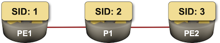

# Simple SR-MPLS with IS-IS

This lab topology describes a simple 3-node network using SR-MPLS with IS-IS.

For general instructions on starting labs, connecting to devices, and generating reports with `netlab`, see [the shared usage documentation](../../docs/use.md).
